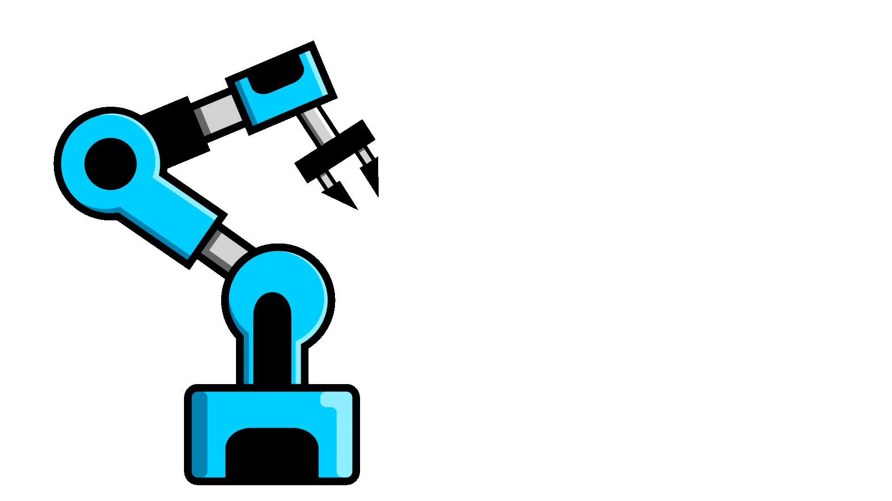
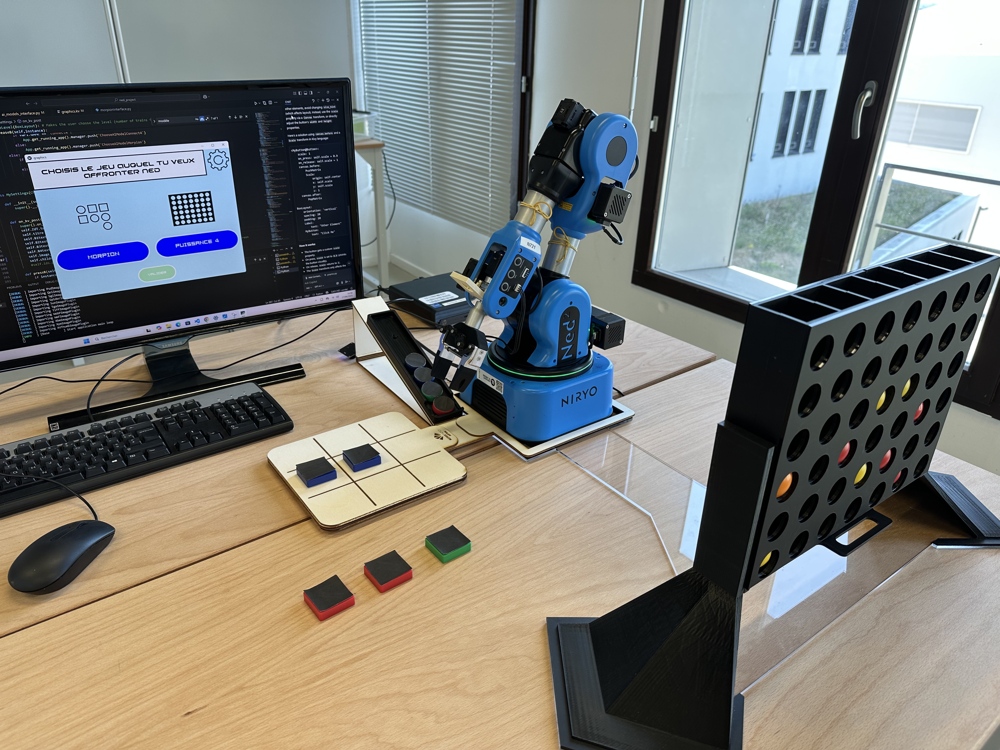
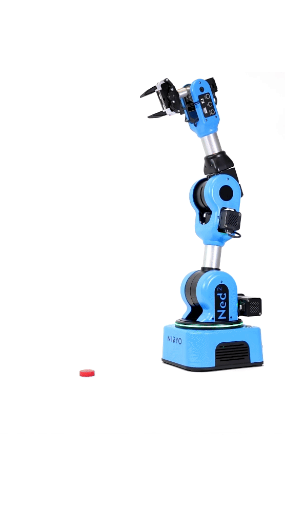
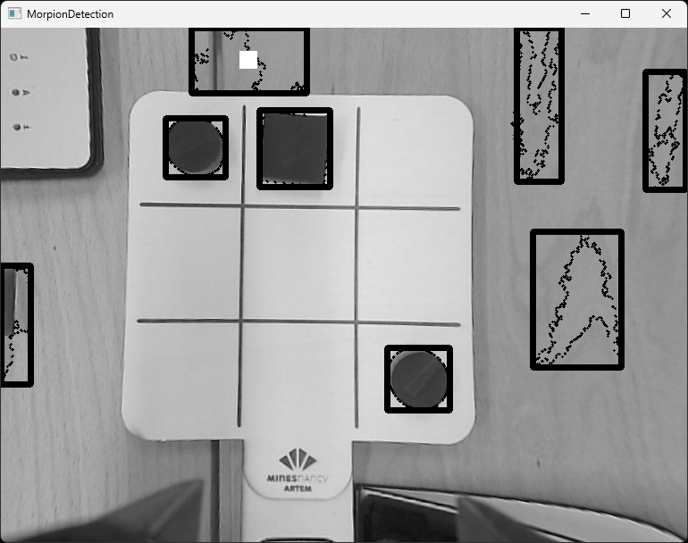
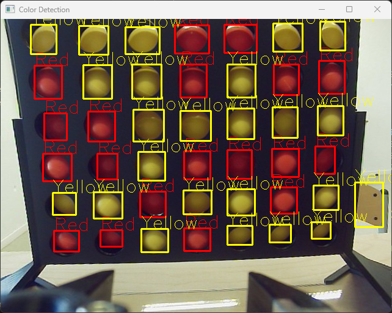
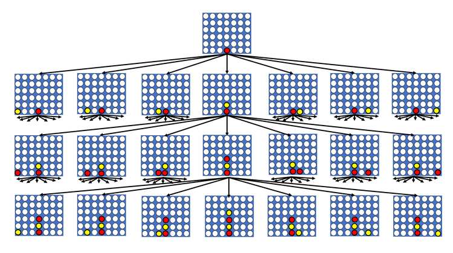
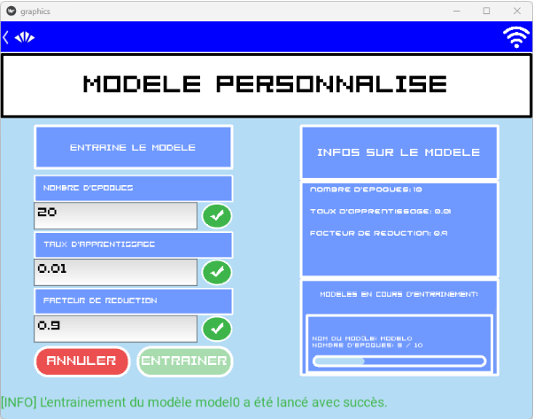

<!--
Hey, thanks for using the awesome-readme-template template.  
If you have any enhancements, then fork this project and create a pull request 
or just open an issue with the label "enhancement".

Don't forget to give this project a star for additional support ;)
Maybe you can mention me or this repo in the acknowledgements too
-->

<!--
This README is a slimmed down version of the original one.
Removed sections:
- Screenshots
- Running Test
- Deployment
- FAQ
- Acknowledgements
-->

<div align="center">

  
  <h1>Project: Robotic Arm playing games </h1>
  
  <p>
    A way to have fun with your Ned2 Nyrio Robot !
  </p>

  
<!-- Badges -->
<p>
  <a href="https://github.com/SamS709/ned_project/graphs/contributors">
    
  </a>

  <a href="https://github.com/SamS709/ned_project/network/members">
    
  </a>
  <a href="https://github.com/SamS709/ned_project/stargazers">
    
  </a>
  <a href="https://github.com/SamS709/ned_project/issues/">
    
  </a>
  <a href="https://github.com/SamS709/ned_project/blob/master/LICENSE">
    
  </a>
</p>
   
<h4>
    <a href="https://github.com/SamS709/ned_project/">View Demo</a>
  <span> · </span>
    <a href="https://github.com/SamS709/ned_project">Documentation</a>
  <span> · </span>
    <a href="https://github.com/SamS709/ned_project/issues/">Report Bug</a>
  <span> · </span>
    <a href="https://github.com/SamS709/ned_project/issues/">Request Feature</a>
  </h4>
</div>

<br />

<!-- Table of Contents -->
# Table of Contents

- [About the Project](#about-the-project)
  * [Introduction](#introduction)
  * [Project Structure](#project-structure)
    * [1. Robotics](#1-robotics)
    * [2. Image Processing](#2-image-processing)
    * [3. Strategies](#3-strategies)
    * [4. Graphics](#4-graphics)

  * [Tech Stack](#tech-stack)


- [Getting Started](#getting-started)
  * [Prerequisites](#prerequisites)
  * [Run Locally](#run-locally)
- [Roadmap](#roadmap)
- [Contributing](#contributing)
  * [Code of Conduct](#code-of-conduct)
- [License](#license)
- [Contact](#contact)
- [Acknowledgements](#acknowledgements)
  

<!-- About the Project -->
## About the Project

<p align="center">
  
</p>

<!-- Introduction -->
### Introduction

<div>
<p>As a student at Les Nancy Mines, my first-year project was the development of a scientific mediation showroom.</p>

<p>The aim is to spark interest in artificial intelligence and robotics among young people. The goal is to spark interest in artificial intelligence and robotics among young people. To achieve this, I decided to create a workshop where visitors can play tic-tac-toe and Connect 4 against a robot arm.</p>

<p>Furthermore, it is a very comprehensive project which allows us to understand many concepts essential to the world of tomorrow.</p>
</div>

### Project Structure

<div>
<p>The project is devided in 3 main parts that interact with each other :</p>

1. [Robotics](#1-robotics)
2. [Image Processing](#2-image-processing)
3. [Strategies](#3-strategies)
4. [Graphics](#4-graphics)
</div>

#### 1. Robotics

<div>
</img>
<p></p>
<p>The Robot used is Ned2 a six-axis collaborative robot, based on open-source technologies.</p>
<p>I controll is with python pyniryo module, provided by the manufacturer, which is very convenient to start robotics.</p>
<p>The classes related to robot control are in the "Robot.py" files located in Morpion and Connect4 folders.</p>
</div>

#### 2. Image Processing

<div>
<p></p>
<p>I used <a href="https://opencv.org/"><b>Open-cv</b></a> python library to process the images returned by the camera of the robot.</p>
<p>In the case of tic-tac-toe, the robot detects the shape of the pieces:</p>

<p>In the case of Connect 4, it detects their color:</p>

<p>The methods related to image processing are also in the Robot classes which is are "Robot.py" files located in Morpion and Connect4 folders.</p>
</div>

#### 3. Strategies

<div>
<p>To determine the next move, the robot can either send the current game grid to a minimax algorithm or to an AI model that will decide the best move to play.</p>
<p>The <a href = "https://en.wikipedia.org/wiki/Minimax">minimax algorithm</a> will explore all possible outcomes of the game to determine the best move.</p>

<p>The AI ​​will rely on prior training (during which it has played many games) to determine the best move. This is <a href = "https://en.wikipedia.org/wiki/Reinforcement_learning">reinforcement learning</a></p>
<p>Note that the user can create its own custom AI model and train it.</p>


<p>The minimax algorithm is located in Morpion(resp. Connect4)/Minimax.</p>
<p>The AI algorithm is located in Morpion(resp. Connect4)/AI.</p>
</div>

#### 4. Graphics

<p>I used <a href = "https://kivy.org">kivy</a> to make the GUI.</p>
<p>Several files are used to manage the interface:</p>
<ul>
<li><b>graphics.py</b> : Game, strategy, and level selection menues will be found here</li>
<li><b>ai_models_interface.py</b> : All the graphics related to AI, such as model edit, training or selection will be here</li>
<li><b>morpion(resp. connect4)Interface.py</b> : Gui for playing against the robot. The purpose of this interface is to tell the robot when to play and to see if the piece detection is working correctly. </li>
<li><b>box_layout_with_action_bar.py</b> : The actionbar which allows you to connect to the robot and to go to previous page. </li>
<li><b>navigation_screen_manager.py</b> : Manage the screens so that we can navigate between menues. </li>
</ul>

<!-- TechStack -->
### Tech Stack

<details>
  <summary>Graphics</summary>
  <ul>
    <li><a href="https://kivy.org">Kivy</a></li>
  </ul>
</details>

<details>
  <summary>AI</summary>
  <ul>
    <li><a href="https://www.tensorflow.org/">Tensorflow</a></li>
  </ul>
</details>

<details>
<summary>Robot</summary>
  <ul>
    <li><a href="https://docs.niryo.com/robots/ned2/">Ned2</a></li>
  </ul>
</details>

<!-- Getting Started -->
## Getting Started

<!-- Prerequisites -->
### Prerequisites

Install Python 3.8.0

Run the following commands required to setup the environnement.

```bash
pip install tensorflow==2.13.0
```
```bash
pip install kivy[full]
```
```bash
pip install matplotlib
```
```bash
pip install pyniryo==1.1.2
```

<!-- Run Locally -->
### Run Locally

Clone the project

```bash
  git clone https://github.com/SamS709/ned_project.git
```

Go to the project directory

```bash
  cd ned_project
```


Start the application

```bash
  python graphics.py
```

<!-- Contact -->
## Contact

Sami LEROUX - sami.lerouxpro@gmail.com

Project Link: [https://github.com/SamS709/ned_project/tree/develop](https://github.com/SamS709/ned_project/tree/develop)

